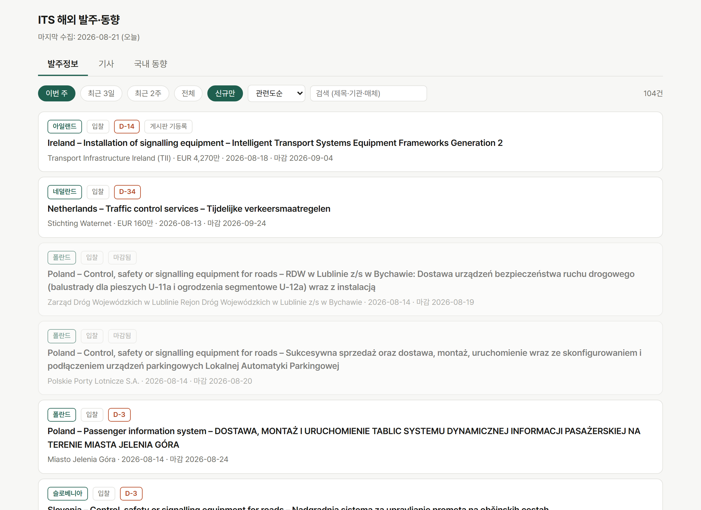

# its-briefing — 해외 ITS 발주·동향 자동 수집

### → https://phone-boot-h.github.io/its-briefing/

해외 지능형교통체계(ITS) **발주공고와 산업 동향**을 매일 아침 6시에 자동으로 모읍니다.
국제기구 조달 API와 뉴스 피드 일곱 곳을 훑어 중복을 걸러내고, ITS 관련도 순으로 줄을 세운 뒤,
사내 게시판에 이미 올라간 건에는 표시를 붙여 둡니다.
**사람이 할 일은 아침에 화면을 열고 쓸 것을 고르는 것뿐입니다.**



## 전에는 어땠나

담당자가 매주 여러 사이트를 손으로 돌았습니다. TED와 세계은행 조달 페이지를 열고, 협회 게시판을 넘기고,
검색어를 바꿔 가며 뉴스를 뒤진 다음, 찾은 건이 이미 게시판에 올라간 것인지 되짚어 눈으로 대조했습니다.
찾는 시간이 쓰는 시간보다 컸습니다.

지금은 그 과정이 매일 새벽에 한 번 끝나 있고, 화면에는 어제까지 없던 것만 남습니다.

## 화면 사용법

탭이 셋입니다. **발주정보 / 기사 / 국내 동향.**

- 기본 화면은 **그 기간에 처음 발견된 것**만 보여줍니다. 한 번 본 공고가 마감까지 몇 주씩 다시 뜨면
  검토 피로만 쌓이기 때문입니다. `신규만` 버튼을 끄면 아직 마감되지 않은 기존 공고까지 나옵니다
- 기간은 `이번 주 / 최근 3일 / 최근 2주 / 전체` 중에 고릅니다. 발주는 이번 주, 기사는 최근 3일이 기본값입니다
- 기사 탭에서는 `해외 / 국내 기업`으로 한 번 더 나눠 볼 수 있습니다
- 카드를 누르면 상세가 열리고 버튼이 셋 있습니다
  - **원문 공고 열기** — 발주기관 페이지로 이동합니다
  - **제목 번역** — 파파고로 제목을 넘깁니다
  - **등록문 복사** — 게시판 등록 서식에 맞춰 클립보드에 담습니다. 붙여넣고 다듬으면 됩니다
- 상세의 `관련` 줄에 **왜 뽑혔는지**가 그대로 적힙니다 (`CPV 34970000, intelligent transport, signalling`)
- 이미 게시판에 올라간 발주에는 `게시판 기등록`이 붙습니다. 기사는 같은 기업이 최근 등록된 경우
  `기업명 최근 등록`으로 표시하는데, 같은 기사라는 뜻은 아닙니다

## 소스 현황

**붙인 곳**

| 소스 | 무엇을 가져오나 |
|---|---|
| TED (EU 조달공고) | ITS 관련 CPV 7종의 신규 입찰공고. 주 30건 안팎으로 가장 굵은 줄기입니다 |
| World Bank | 조달공고 + 조달계획·사업문서. 공고 이전 기획단계까지 잡힙니다 |
| ADB (아시아개발은행) | 교통 섹터 조달공고. 게시판 관심의 47%가 아시아인데 비어 있던 자리입니다 |
| 구글뉴스 RSS | 영문 8개 / 한국어 5개 / 정책 5개 검색어 |
| ITS Korea 게시판 | 협회가 추린 국내 동향과 해외 영문 기사 |
| 국토교통부 | 보도자료. 부처 원문이라 노출 상한을 면제합니다 |
| 법제처 | 교통 관련 입법예고. 위와 같습니다 |

API 키를 하나도 쓰지 않습니다. 관리할 자격증명이 없으니 만료로 멈추는 일도 없습니다.

**안 붙인 곳**

판정 기준은 **순기여**입니다. 이미 붙은 소스와 겹치지 않는 ITS 건이 주당 몇 건 늘어나는가.
TED 한 곳이 주 30건이고, 여기에 주 2건을 더하려고 관리 대상을 늘리지는 않았습니다.
물량이 많다고 붙이는 것도 아닙니다 — SAM.gov(미국 연방조달)는 조회 기간에 215건이 잡혔지만
ITS 핵심어에 걸린 건 0건이었습니다. 미국 ITS 발주는 주(state) DOT 소관이라 연방 조달망에 오지 않습니다.

<details>
<summary>조사 전체 보기 — 후보 10곳 판정</summary>

| 소스 | 판정 | 이유 |
|---|---|---|
| IDB (미주개발은행) | 보류 | Power BI 임베드, 토큰 디코더 필요. 주 4건 |
| UK Find a Tender | 보류 | 공식 API 열림. 게시판 기등록 400건 중 영어권 선진국 5건 |
| SAM.gov | 보류 | ITS 매칭 0건 (주 DOT 소관) |
| AfDB · 인도네시아 INAPROC · 몽골 · 호주 AusTender · 캐나다 CanadaBuys | 기각 | 전 경로 403 차단 |
| IsDB · AIIB · 인도 eProcure · 싱가포르 GeBIZ | 기각 | 목록 URL 404, 자바스크립트 렌더, 세션 필요 |
| 미국 주 DOT (Caltrans·FDOT·TxDOT 등) | 기각 | 주마다 별개 사이트, 50곳 |
| EBRD · EIB · JICA | 이월 | 셋 합쳐 주 10건 |
| NIB | 기각 | 최신 공고 2020년 |
| 네이버 뉴스 · 언론사 개별 RSS | 기각 | 봇 차단 / 구글뉴스와 중복 |

실측치는 [docs/설계확정.md](docs/설계확정.md) 7장에 있습니다.

</details>

## 만들면서 나온 문제와 조치

- **세계은행은 조달공고만 봐서는 부족했다** — 조달공고 API만으로는 게시판 기등록분의 30%밖에 안 잡혔다
  → 문서(WDS) API 2종을 더 붙여 91건 중 **90건(99%)** 재발견.

- **TED 점수가 양쪽으로 틀렸다** — 체코 과속단속 레이더처럼 사업명이 현지어면 영어 키워드에 안 걸려 0점이었고,
  반대로 브르노 ITS 3단계는 부수 CPV가 잔뜩 붙어 잡화로 오인돼 감점됐다
  → CPV 코드로 기본점을 깔고 영어 키워드는 보너스로 얹었다. 감점은 CPV가 15개 이상 붙은 건으로 좁혔다.

- **필터가 진짜 ITS 사업을 지웠다** — 케냐 Horn of Africa Gateway(P161305)는 제목에 교통 단어가 없어 탈락했다.
  결과만 봐서는 안 보이고 정답지와 대조해야 잡힌다
  → 섹터 태그가 붙은 자료에는 제목 필터를 걸지 않는다. 채점 회귀 3건을 `verify.py`에 고정 입력으로 박아,
  같은 일이 재발하면 갱신이 멈춘다.

- **같은 기사가 매일 신규로 떴다** — 구글뉴스 RSS 링크는 요청마다 바뀌는 토큰이다. 링크로 id를 만들었더니
  어제 본 기사가 오늘 새 항목이 됐다 → id를 정규화한 제목의 해시로 교체.

- **날짜가 하루씩 밀렸다** — 실행 환경이 UTC라 새벽에 돌면 수집 창과 마감 D-day가 밀렸다
  → 날짜 계산을 전부 KST 기준으로.

- **부처 원문이 뉴스에 밀려났다** — 하루 5건 노출 상한을 국토교통부·법제처 원문이 일반 기사와 나눠 쓰고 있었다
  → 부처 보도자료와 입법예고는 상한 면제.

- **섹터 태그를 그대로 믿을 수 없었다** — ADB의 `Transport` 태그가 다부문 사업에도 붙어 관광·스포츠 전문가
  채용이 24건 섞여 들어왔다 → 제목 교통어 게이트를 걸어 10건으로. 게시판 ADB 기등록 30건 중 **25건(83%)**
  재조회 확인.

- **막힌 소스는 우회하지 않았다** — AfDB·인도네시아·몽골·호주·캐나다는 403, 인도·싱가포르는 세션·자바스크립트
  벽이었다 → 전부 기각. 비공식 우회는 언제 끊길지 모르고, 끊긴 걸 아무도 모르는 게 더 나쁘다.

- **같은 사안이 여러 건으로 남는다** — 천안 자율주행버스 기사 5건이 그대로 5건이었다 → 문자 단위 유사도로는
  안 묶이고, 문턱을 더 낮추면 다른 사안이 묶인다. 여기서 멈췄고 최종 선택은 사람이 한다.

## 어떻게 돌아가나

```
GitHub Actions (매일 06:00 KST)
  └ collect.py   소스 조회 → 중복 제거 → 관련도 채점 → data/*.json 커밋
       └ verify.py   스키마·중복·채점 회귀 검사 (실패하면 갱신 중단)
            └ GitHub Pages   화면
```

한 소스가 죽어도 나머지는 수집됩니다. 그때는 화면 상단에 `수집 실패: adb`처럼 뜹니다.
다만 **전체 결과가 0건이면 실패로 끝냅니다** — 조용히 빈 화면이 뜨는 게 가장 나쁜 고장이라서입니다.

## 로컬에서 실행

```bash
python collect.py     # 수집 (표준 라이브러리만 씁니다)
python verify.py      # 검증
python -m http.server 8765
```

브라우저에서 `http://localhost:8765`. `index.html`을 직접 열면 브라우저가 JSON 읽기를 막아 빈 화면이 뜹니다.

## 알아둘 것

구글뉴스 RSS, 파파고 번역 링크, ADB 조달 조회처럼 공식 API가 아닌 경로를 일부 씁니다. 예고 없이 바뀔 수 있고,
그때는 화면 상단의 `수집 실패` 표시와 갱신되지 않는 `마지막 수집` 날짜로 드러납니다.

설계 결정과 소스 조사 실측치는 [docs/설계확정.md](docs/설계확정.md)에 있습니다.

## 문의

hantaeyoung5@gmail.com
